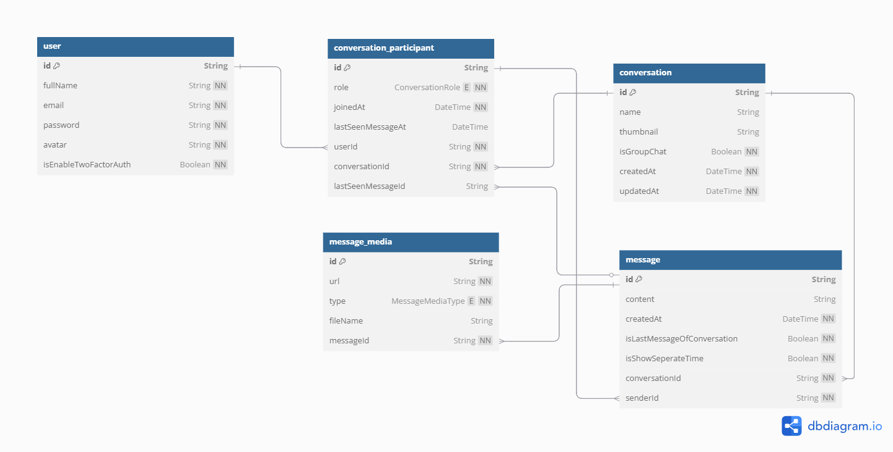

# Web Chat Realtime

## 1. Feature

- Sign up, login (include login with google), forgot password
- Two-factor authentication (2FA)
- Update personal information such as change avatar, name, password
- Search for other registered users by name, username, or email to start conversation
- Users can send and receive text messages in real-time.
- User can see when a message has been read by other.
- Send images & videos: users can share photos and videos within the chat.
- Send documents & other files: supports file sharing, including PDFs, word documents, and other formats.
- Preview media files: allows users to preview images and videos directly in the chat.
- Dark/light mode.

## 2. Techstack

- Server: NestJS, MySQL, Redis, Prisma, WebSockets, JWT, OTPLib, Cloudinary, Node mailer,...
- Client: NextJS (app router), Next auth, Shadcn ui, TailwindCSS, Zod, Zustand, Socket io client, Axios, React query, Swiper,...
- Deploy: Docker, Docker compose

## 3. Database ERD



## 4. How to run

- First, you need to create a `.env` file following the structure of the `.env.example` file.
- Then, run server:
  ```bash
  docker compose -f docker-compose.backend.yaml up --build -d
  ```
- And client:
  ```bash
  docker compose -f docker-compose.frontend.yaml up --build -d
  ```

## 4. Demo

- [Watch demo](https://drive.google.com/file/d/1CG1XZtVsZarGA6jwsGkxWad0Fn9cwpLS/view?usp=drive_link)
